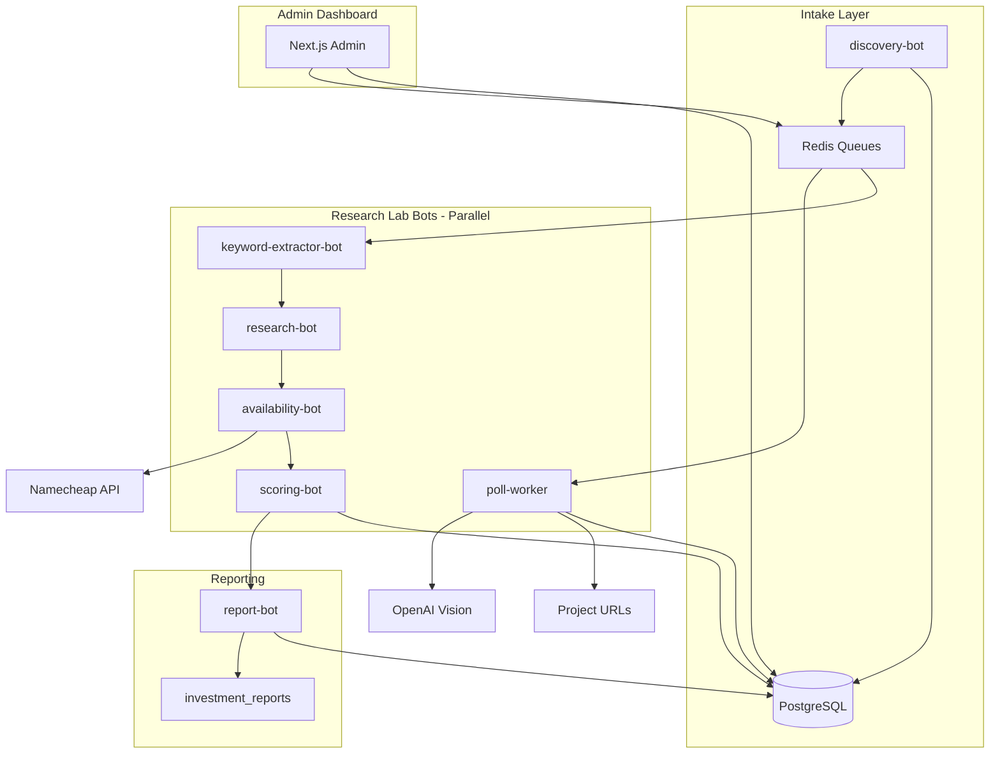

# Domzop — Portfolio Manager

Portfolio manager for **domains** and **real estate**, with a research lab that surfaces domain opportunities, scores investment potential, and generates investor-facing reports.

## Architecture



### Bot pipeline

| Bot | Queue | Input | Output |
|-----|-------|-------|--------|
| **discovery-bot** | `queue:poll`, `queue:extract_keywords` | New project signals | Candidates in DB |
| **keyword-extractor-bot** | `queue:extract_keywords` ? `queue:research` | Project URL + slug | Keywords in `keywords` table |
| **research-bot** | `queue:research` ? `queue:availability` | Keywords | Category, trends in `research_results` |
| **availability-bot** | `queue:availability` ? `queue:score` | Domain names | `.com`/TLD availability |
| **scoring-bot** | `queue:score` | All signals | `investment_score` on candidates |
| **report-bot** | `queue:report` | Investor profiles | JSON + Markdown reports |
| **poll-worker** | `queue:poll`, `queue:evaluate` | Project URLs | Poll snapshots, quality scores |

### Scoring model

Weighted multi-criteria scoring (inspired by cizher KhwarizmiEngine):

| Axis | Weight | Signals |
|------|--------|---------|
| Project maturity | 25% | Poll count, DOM changes, quality score |
| Keyword quality | 20% | Extracted keyword weights |
| Availability | 20% | `.com` registrar check |
| Research signals | 25% | Trend score, brandability, competition |
| Hosting signal | 10% | Relative hosting maturity weight |

Confidence bands: **strong** (?75), **moderate** (?55), **ambiguous** (<55).

## Quick start

```bash
cp .env.example .env
# Fill in Namecheap + OpenAI keys when ready

docker compose up
```

**Existing database?** Apply newer migrations manually:

```bash
docker compose exec -T postgres psql -U domzop -d domzop < supabase/migrations/002_research_lab_schema.sql
docker compose exec -T postgres psql -U domzop -d domzop < supabase/migrations/003_portfolio_schema.sql
```

This starts all services in parallel:
- `postgres`, `redis` ? data layer
- `discovery-bot` ? candidate intake
- `poll-worker` ? site polling + AI quality gate
- `keyword-extractor-bot`, `research-bot`, `availability-bot`, `scoring-bot`, `report-bot` ? research lab pipeline
- `admin` — dashboard on [http://localhost:3000](http://localhost:3000) (Portfolio, Candidates, Investors, Reports, Bots)

### Scale individual bots

```bash
docker compose up --scale keyword-extractor-bot=2 --scale research-bot=2
```

## Configuration

| Variable | Default | Description |
|----------|---------|-------------|
| `TARGET_SUFFIXES` | (see `.env.example`) | Host filters for candidate intake |
| `POLL_INTERVAL_HOURS` | `24` | Time between site polls |
| `QUALITY_SCORE_THRESHOLD` | `75` | Min score to trigger purchase |
| `AUTO_PURCHASE_ENABLED` | `false` | Safety: manual buy via admin by default |
| `NAMECHEAP_SANDBOX` | `true` | Use sandbox API until production-ready |
| `REPORT_INTERVAL_MINUTES` | `60` | Auto-report generation interval |
| `BOT_NAME` | ? | Set per bot container (keyword-extractor, research, etc.) |

## Investor profiles

Configure via **Admin ? Investors** or directly in the `investor_profiles` table:

| Field | Purpose |
|-------|---------|
| `categories` | Filter by saas, ai, fintech, devtools, etc. |
| `min_score` | Minimum investment score threshold |
| `tlds` | Target TLDs (default: `com`) |
| `budget_usd` | Max domain budget |
| `excluded_keywords` | Skip candidates matching these terms |

Reports are generated by `report-bot` (hourly) or on-demand from **Admin → Reports**.

## Portfolio

Holdings live in a unified `assets` book with type-specific detail tables:

| Table | Role |
|-------|------|
| `assets` | Name, status, cost basis, current value, currency, notes |
| `domain_holdings` | Domain name, registrar, expiry, TLD |
| `real_estate_holdings` | Address, property type, occupancy, rent, taxes |
| `valuations` | Mark history (`manual`, `appraisal`, `estimate`) |

**Add a property:** Admin → Portfolio → Add holding → Real estate (address, type, occupancy, cost, current value, rent, taxes).

**Add a domain:** Admin → Portfolio → Add holding → Domain (name, registrar, cost, current value, expiry). If the name already exists as a research candidate, the holding is linked. Buying a candidate from the pipeline also upserts a domain asset (`owned`).

Statuses: `watchlist`, `owned`, `listed`, `sold`, `discarded`. Auto-purchase stays off (`AUTO_PURCHASE_ENABLED=false`).

## Project layout

```
domzop/
    admin/                      # Next.js dashboard
      src/app/
        portfolio/              # Holdings dashboard, add, detail
        investors/              # Investor profile CRUD
        reports/                # Report viewer + download
        bots/                   # Bot status + queue depths
        candidates/[id]/        # Keyword/research detail view
    services/
      ingestion/                # discovery-bot (candidate intake)
      workers/                  # poll-worker (poll + quality gate)
      bots/                     # Research lab bots (5 consumers)
    supabase/migrations/
      001_initial_schema.sql
      002_research_lab_schema.sql
      003_portfolio_schema.sql
    docker-compose.yml
```

## Integration with cizher (XEARCH)

`D:\cizher` is an Ubuntu Touch app bundle for XEARCH (spiritual research lab), not domain infrastructure. Patterns adapted into domzop:

| cizher Pattern | domzop Adaptation |
|----------------|-------------------|
| **Adapter-based keyword extraction** (`CodeIntelligenceAdapter`) | Category keyword patterns in `research.py` |
| **KhwarizmiEngine weighted scoring** | `scoring.py` multi-criteria investment score |
| **UnifiedReportApp** synthesis | `report.py` investor report generator |
| **API + offline fallback** (`quranTextService`) | Registrar check with graceful skip when unconfigured |
| **Service worker PWA caching** | Available for future admin offline mode |

Domain-specific backend (intake, Redis queues, Namecheap, PostgreSQL) was already in domzop and was extended, not copied from cizher.

## State machine

| Status | Meaning |
|--------|---------|
| `discovered` | Newly ingested candidate, pending first poll |
| `monitoring` | Active polling cycle |
| `evaluated` | AI quality gate completed |
| `purchased` | `.com` acquired via registrar |
| `discarded` | Removed (unavailable, low score, abandoned, manual) |

## Tests

```bash
# Ingestion parser tests
cd services/ingestion
pip install -r requirements-dev.txt
pytest tests/

# Research lab bot heuristics
cd services/bots
pip install -r requirements.txt -r requirements-dev.txt
pytest tests/
```

## Next steps

1. Wire Namecheap `domains.create` for real purchases (keep `AUTO_PURCHASE_ENABLED=false` until tested).
2. Add LLM-powered research enrichment (optional OpenAI category analysis).
3. Persist screenshots to S3/Supabase Storage.
4. Add auth (NextAuth or Supabase Auth) to admin dashboard.
5. Recover XEARCH source from `Axstart/XEARKLAB/Axview` for richer ResearchCanvas UI in admin.

## Deploy

### What runs where

| Component | Hosting |
|-----------|---------|
| Next.js admin (`admin/`) | **Vercel** |
| Python bots (`services/`) | Railway, Fly.io, or similar + Docker |
| Postgres + Redis | Docker Compose locally, or managed DB/Redis for production |

`AUTO_PURCHASE_ENABLED` stays `false` until you explicitly enable purchases.

### Admin on Vercel

1. Push this repo to GitHub.
2. Import the project in Vercel with **Root Directory** = `admin`.
3. Set env vars (see `admin/.env.example`): DATABASE_URL, REDIS_URL, ADMIN_API_SECRET, NEXT_PUBLIC_APP_URL.
4. Deploy. Without DB/Redis the UI still loads with empty data.

### Bots later

Run `docker compose up` (or equivalent) for Postgres, Redis, discovery, workers, and research lab. Add Namecheap + OpenAI keys to the bot environment when ready.

---

## OPERATOR NOTES (private)

Internal ops only ? not marketing copy. Candidate intake filters host suffixes via `TARGET_SUFFIXES` (see `.env.example`). Ingestion lives under `services/ingestion/`. Do not restate intake method or host filters in public UI, README hero, or investor-facing materials.
